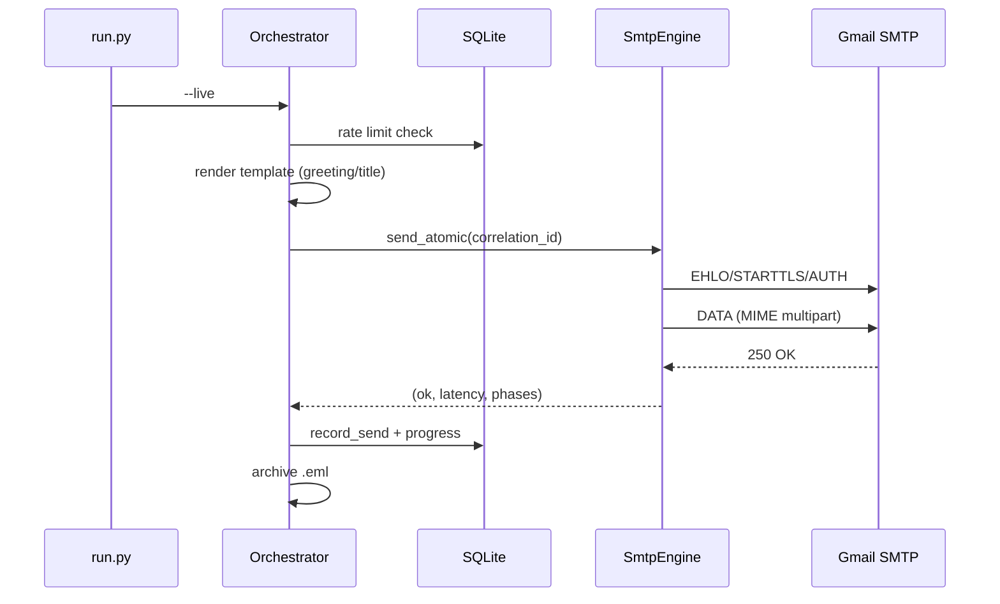

# Development

## Setup

```bash
pip install -e ".[dev]"
pre-commit install
```

## Commands

```bash
make test        # pytest + coverage (103 tests, 80%+ gate)
make lint        # ruff check
make typecheck   # mypy
make security    # bandit
make doctor      # system diagnostics
make all         # lint + typecheck + test + security + doctor
```

## Architecture

```
run.py                  CLI entry point (15 modes)
├── core/               config, database, logger, validator, tracker,
│                       doctor, ratelimiter, lock, metrics, notifications,
│                       i18n, secrets, dns_validator, email_quality, wizard
├── engine/             orchestrator, smtp, templates, plugins
├── parsing/            parser (TXT/CSV/JSON/YAML/XLSX), bounce classifier
├── exports/            JSON/CSV/HTML report generation
└── tests/              103 unit + fuzz tests
```

## Sequence: live send



## Testing

```bash
pytest tests/ -v              # 103 tests
pytest tests/test_fuzz.py     # malformed-input fuzzing
```

CI runs ruff, mypy, bandit, pip-audit, safety, and the test matrix
(3 OS × Python 3.10–3.12).
